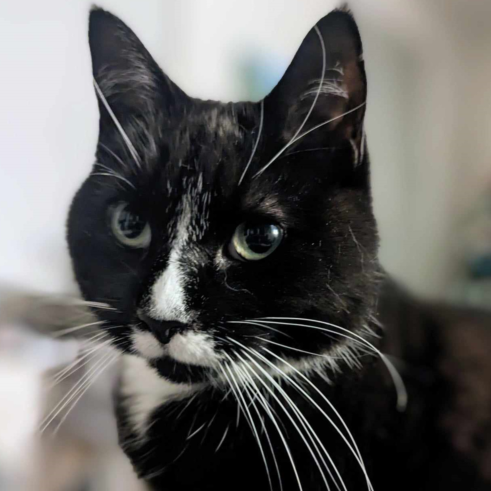
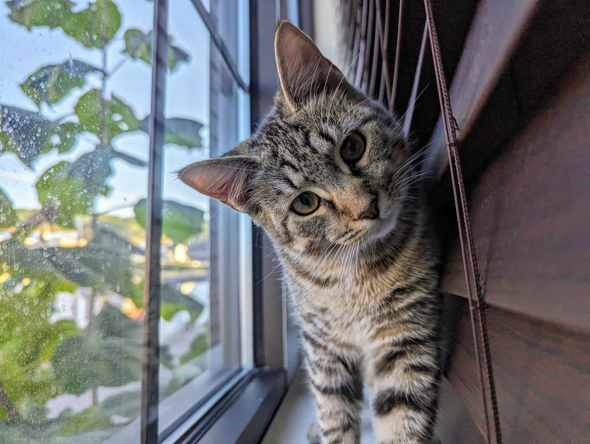

```{r setup, include=FALSE}
knitr::opts_chunk$set(echo = FALSE)
```
Here is our chance to highlight some of the most important people in our lives. These people have been there through tough times and great times. As we highlight these friends we ask you, if you see them around, to thank them for being such an important part of the pathes that have lead us here today. 

Dear wedding party, an innumerably and indissoluble Thank You, Gracias, Merci


####
## Luna Muñoz Valencia
### Hermana of Honour


```{r}
paths <- c(  "images/Luna_3.png", "images/Luna_1.jpg", "images/Luna_2.jpeg")
pixture::pixgallery(paths)
```
  
  Esta experiencia es difícil de explicar porque no encuentro palabras suficientes para
describir todo lo que me hace sentir. Hemos sido cómplices, mejores amigos y compañeros
de vida desde siempre. Al verte hoy aquí, a punto de casarte, siento una mezcla de
nostalgia, emoción y felicidad. Me emociona ver todo lo que hemos crecido y la hermosa
persona en la que te has convertido.
Hoy mi mejor amigo, mi héroe, mi hermano se casa con una gran mujer, una persona a la
que admiro y quiero mucho. Verte feliz a su lado me llena de alegría, porque sé que has
encontrado a alguien con quien compartir todo lo bueno que llevas dentro.
Siempre hemos sido los dos contra el mundo, y sé que eso nunca cambiará. En mí siempre
encontrarás apoyo, amor, admiración y respeto. Eres un hombre con un corazón enorme,
generoso, noble y lleno de cosas buenas para ofrecer. Estoy convencida de que esta
relación es fuerte, los dos son personas maravillosas, merecedoras uno del otro
Hoy es un día muy especial. Hoy es su día. El día en que nos hacen testigos de su amor, de
su unión y del comienzo de una nueva etapa juntos. Gracias por darme la alegría y el
privilegio de ser tu hermana. Es algo que me llena de orgullo y que me ha dado fuerza y
seguridad durante toda mi vida.
Felicidades a los dos. Que nunca les falten motivos para sonreír, para elegirse cada día y
para seguir caminando juntos de la mano.
Escribiendo esto con el corazón en las manos, atentamente
-Tu hermana
 :::
 
<br> 
<br>

<!-- ::: {.floatting}  -->

<!-- ## Diana Sanabria Romero -->
<!-- ### Groomsmate -->
<!-- ```{r} -->
<!-- paths <- c(  "images/Diana_1.jpg", "images/Diana_2.jpg") -->
<!-- pixture::pixgallery(paths) -->
<!-- ``` -->

<!--  ::: -->

<!-- <br>  -->
<!-- <br> -->

<!-- ::: {.floatting}  -->

<!-- ## Diego Anzola Bustos -->
<!-- ### Groomsmate -->

<!-- ```{r} -->
<!-- paths <- c(  "images/Anzola_1.jpeg", "images/Anzola_2.jpeg") -->
<!-- pixture::pixgallery(paths) -->
<!-- ``` -->

<!--  ::: -->


<!-- <br>  -->
<!-- <br> -->
<!-- <br>  -->
<!-- <br> -->

::: {.floatting} 


::: {.floatting} 


## Prince Poirier
### Homme of Honour


```{r}
paths <- c(  "images/Prince_1.jpg", "images/Prince_2.jpeg")
pixture::pixgallery(paths)
```
  Prince has known Monique since Grade 4! As kids they bonded over Beanie Babies and singing 60s pop songs. They’ve been friends for over 20 years. Prince likes horror movies and dancing until he passes out.  
 :::

<br> 
<br>

::: {.floatting} 

## Gee Peeva
### Bridesmate


```{r}
paths <- c(  "images/Gee_1.jpg", "images/Gee_2.jpg")
pixture::pixgallery(paths)
```

  I met Monique on the first day of grade 10, she was the first person to talk to me in school as a new student when I knew no one. I didn’t realize that our paths crossing that day would result in over 17 years of lore.  Monique has always been an incredibly inspiring, kind hearted, and hilarious, brilliant mind for as long as I’ve known her. She always encouraged me to be brave and reach for my goals, from teaching me to play bass in music class when I was 16 to making me introduce myself to a band when I was 22, that I now work my dream job for. We witnessed each other change and persevere and chase our dreams. I couldn’t be more proud of who she is and I’m honoured to still be a part of her journey to this day. I’m so grateful to know you and to call you my precious friend. 
  Once you share a cookie you know it’s true!!! ❤️  
 :::
 
<br> 
<br>

::: {.floatting} 

## Kimberly Wong
### Bridesmate


```{r}
paths <- c(  "images/Kim_1.jpg", "images/Kim_2.JPG")
pixture::pixgallery(paths)
```

  Here’s proof that chaos is the best kind of friendship! 
KimoniqueCowbueingyZeraffephantOnASkateboardWithWings forever!  
 :::
 
<br> 
<br>

::: {.floatting} 

## Leslie Zhen
### Bridesmate


```{r}
paths <- c(  "images/LZ_1.jpg", "images/LZ_2.jpg")
pixture::pixgallery(paths)
```

Leslie met Monique in school in 2020. We were in a zoom chat for a class and she figured out the code for the stats question sooooooooo fast. I like to think that she’s part of the reason why I now know how to add error bars on plots. Since then, we’ve shared many snack filled adventures, heists, and plenty of mischief. I am grateful for our friendship and so happy to celebrate this exciting chapter of your life. 

### Slightly solicited advertisement break: 
Hello. This is your local Guyco messaging you about a limited time offer prepared just for you. Did you that 15 minutes can save you 15 percent or more on friend insurance? Well, we have an even better offer just for you! You spend 16 minutes and we will throw in a toaster so you can be extra toasty this winter. Hurry and claim you offer now! Please message 412-447-1826 to claim your offer. Message and data rates may apply.   
 :::

 
<br> 
<br>
<br> 
<br>

::: {.floatting} 


# Honourable Michi

<br>
<br>

::: {.floatting}

```{r out.width='50%', out.extra='style="float:right; padding:10px"', echo=FALSE}

```
# Pippin
### La Pelousita
Pippin's been fixing up her tux for the occasion
:::


<!-- <br> -->
<!-- <br> -->

<!-- ::: {.floatting} -->

<!-- ```{r out.width='50%', out.extra='style="float:right; padding:10px"', echo=FALSE} -->
<!--  -->
<!-- ``` -->
<!-- # Evie -->
<!-- ### Floof Ambassador -->
<!-- Evie likes to nap. -->
<!-- ::: -->
