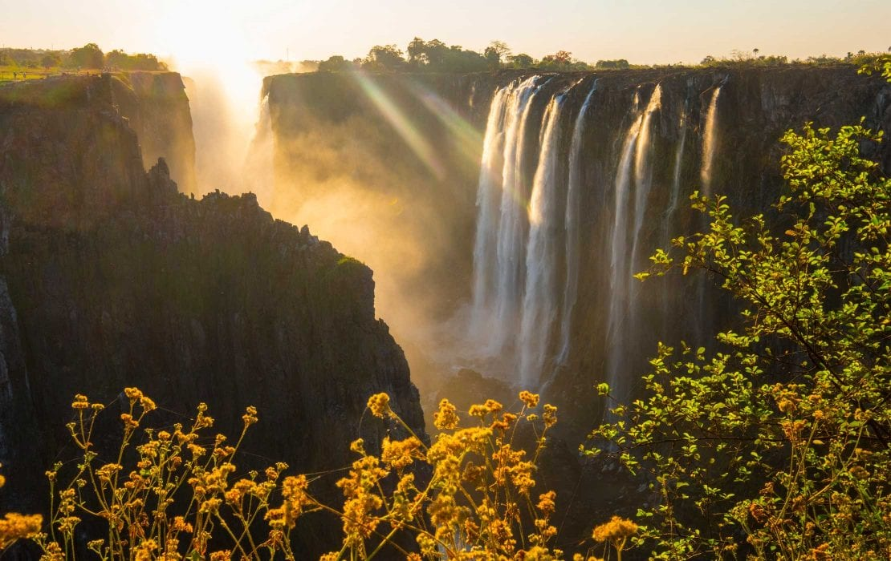

```{r setup, include=FALSE}
knitr::opts_chunk$set(echo = FALSE)
```

<center>
::: {.floatting}
### Victoria falls honeymoon fund ###
<a href = "https://account.venmo.com/u/Monique-Tardif">
```{r out.width='25%', echo=FALSE}
 
```

#### Our favourite memories together involve travelling, whether from roadtrips, foodtrips, to flying across the globe. We chose Victoria falls as a honeymoon destination for a few reasons: 
1) We love water, and waterfalls. Fallingwater is a big part of our memories together
2) Mountains and surreal terrains is a close second to beautiful bodies of water
3) What a perfect excuse to go somewhere further away than ever before, than getting lost on our honeymoon
:::
</a>

<!-- ::: {.floatting} -->
<!-- ### Victoria falls honeymoon fund ### -->
<!-- <a href = "https://account.venmo.com/u/Monique-Tardif"> -->
<!-- ```{r out.width='25%', out.extra='style="float:left; padding:10px"', echo=FALSE} -->
<!--   -->
<!-- ``` -->
<!-- ::: -->
<!-- </a> -->

<!-- ::: {.floatting} -->
<!-- <a href = "https://www.amazon.com/wedding/share/jina_leslie"> -->
<!-- ```{r out.width='30%', out.extra='style="float:right; padding:10px"', echo=FALSE} -->
<!-- knitr::include_graphics("images/amazon.png")  -->
<!-- ``` -->
<!-- ::: -->
<!-- </a> -->


<!-- <br> -->
<!-- <br> -->
<!-- <br> -->
<!-- <br> -->
<!-- <br> -->
<!-- <br> -->
<!-- <br> -->
<!-- <br> -->
<!-- <br> -->

<!-- ::: {.floatting} -->
<!-- <a href = "https://www.target.com/gift-registry/gift/jina-leslie4"> -->
<!-- ```{r out.width='30%', out.extra='style="float:left; padding:10px"', echo=FALSE} -->
<!-- knitr::include_graphics("images/target.png")  -->
<!-- ``` -->
<!-- ::: -->
<!-- </a> -->


<!-- ::: {.floatting} -->
<!-- <a href = "https://www.potterybarn.com/registry/5rh9p2vxtk/registry-list.html"> -->
<!-- ```{r out.width='30%', out.extra='style="float:right; padding:10px"', echo=FALSE} -->
<!-- knitr::include_graphics("images/potterybarn.png")  -->
<!-- ``` -->
<!-- ::: -->
<!-- </a> -->
<!-- </center> -->