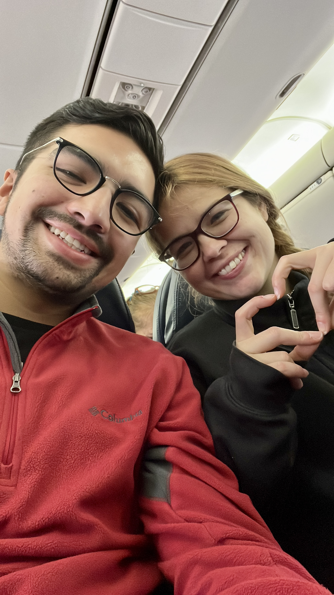
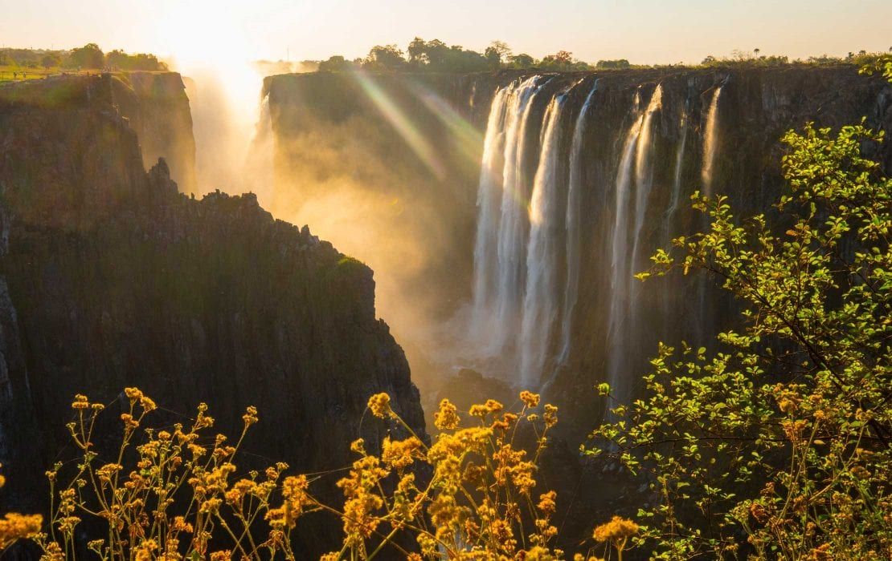

```{r setup, include=FALSE}
knitr::opts_chunk$set(echo = FALSE)
```

<center>
::: {.floatting}
# Honeymoon Fund ###
<a href = "https://account.venmo.com/u/Monique-Tardif">
```{r out.width='50%', echo=FALSE}
 
```

## Our favourite memories involve travelling together
Roadtrips, foodtrips, to flying across the globe. We chose to split our honeymoon into two trips. The first will be to Copenhagen, Denmark! 
We were able to secure a reservation to the iconic Michelin star winning Alchemist, and Kadeau restaurants. We are excited to eat sensational foods in a bicycling friendly city!

The second will be Zambia, including Victoria falls! Why you may ask? 
1) We love water, and waterfalls. Fallingwater is a big part of our memories together
2) Mountains and surreal terrains is a close second to beautiful bodies of water as our favourites
3) Alejandro will be doing an international placement in Zambia and it's a perfect opportunity to extend the trip

### If you prefer to give us a physical gift here are some options: 


#### <a href="https://www.lecreuset.com/signature-sauteuse-3-1-2-qt/21198US.html"> Le Creuset Signature Sauteuse, Colour: Provence
</a>

#### <a href="https://www.lecreuset.com/round-dutch-oven/21177US.html"> Le Creuset Signature Round Dutch Oven, Colour: Provence </a>

:::
</a>

<!-- ::: {.floatting} -->
<!-- ### Victoria falls honeymoon fund ### -->
<!-- <a href = "https://account.venmo.com/u/Monique-Tardif"> -->
<!-- ```{r out.width='25%', out.extra='style="float:left; padding:10px"', echo=FALSE} -->
<!--   -->
<!-- ``` -->
<!-- ::: -->
<!-- </a> -->

<!-- ::: {.floatting} -->
<!-- <a href = "https://www.amazon.com/wedding/share/jina_leslie"> -->
<!-- ```{r out.width='30%', out.extra='style="float:right; padding:10px"', echo=FALSE} -->
<!--   -->
<!-- ``` -->
<!-- ::: -->
<!-- </a> -->


<!-- <br> -->
<!-- <br> -->
<!-- <br> -->
<!-- <br> -->
<!-- <br> -->
<!-- <br> -->
<!-- <br> -->
<!-- <br> -->
<!-- <br> -->

<!-- ::: {.floatting} -->
<!-- <a href = "https://www.target.com/gift-registry/gift/jina-leslie4"> -->
<!-- ```{r out.width='30%', out.extra='style="float:left; padding:10px"', echo=FALSE} -->
<!--   -->
<!-- ``` -->
<!-- ::: -->
<!-- </a> -->


<!-- ::: {.floatting} -->
<!-- <a href = "https://www.potterybarn.com/registry/5rh9p2vxtk/registry-list.html"> -->
<!-- ```{r out.width='30%', out.extra='style="float:right; padding:10px"', echo=FALSE} -->
<!--   -->
<!-- ``` -->
<!-- ::: -->
<!-- </a> -->
<!-- </center> -->