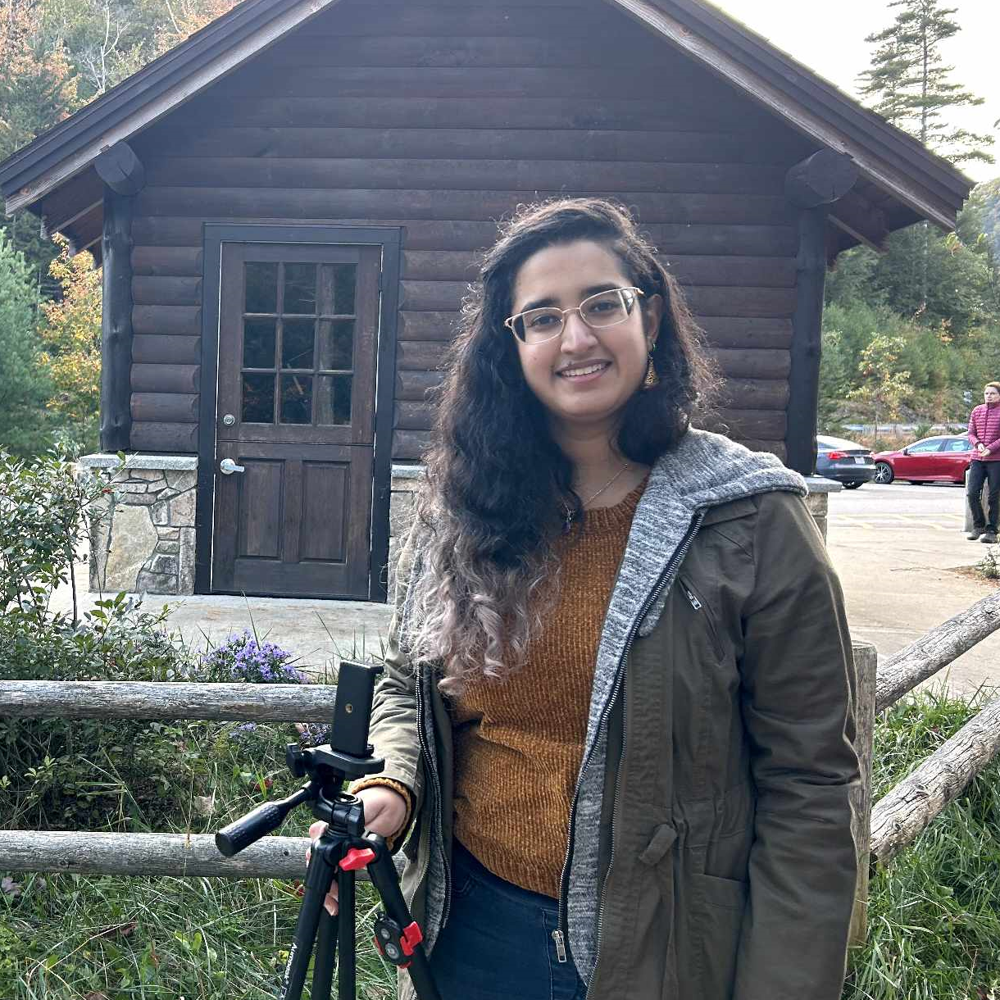
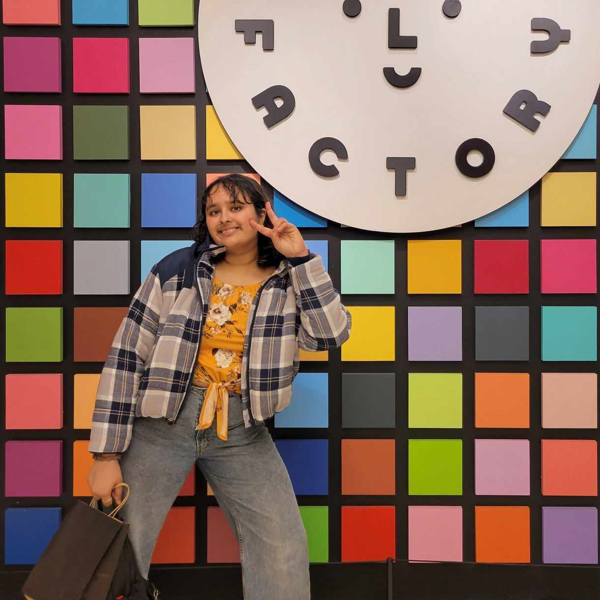
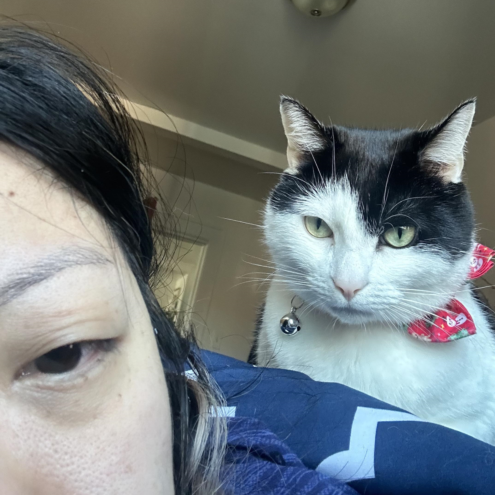
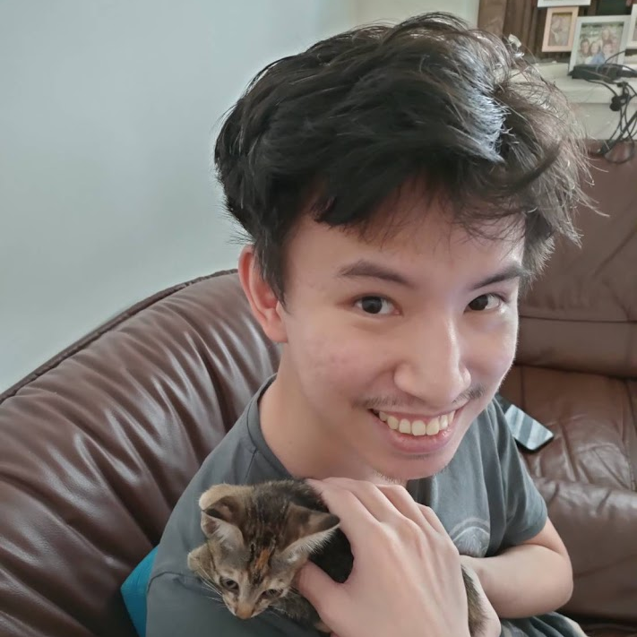

::: {.floatting}

```{r out.width='40%', out.extra='style="float:right; padding:10px"', echo=FALSE}
knitr::include_graphics("images/steph.png")
```
# Stephanie
### BFF of Honor

:::


<br>
<br>

::: {.floatting}

```{r out.width='40%', out.extra='style="float:right; padding:10px"', echo=FALSE}

```

# Ali
### Bridesmate

:::


<br>
<br>

::: {.floatting}

```{r out.width='40%', out.extra='style="float:right; padding:10px"', echo=FALSE}
knitr::include_graphics("images/malisha.png")
```

# Malisha
### Bridesmate

:::


<br>
<br>

::: {.floatting}

```{r out.width='40%', out.extra='style="float:right; padding:10px"', echo=FALSE}

```

# Manasa
### Bridesmate

:::


<br>
<br>

::: {.floatting}

```{r out.width='40%', out.extra='style="float:right; padding:10px"', echo=FALSE}

```

# Pooja
### Bridesmate

:::


<br>
<br>

::: {.floatting}

```{r out.width='40%', out.extra='style="float:left; padding:10px"', echo=FALSE}
knitr::include_graphics("images/victor.png")
```

# Victor
### Best Brother

:::


<br>
<br>

::: {.floatting}

```{r out.width='40%', out.extra='style="float:left; padding:10px"', echo=FALSE}

```

# I
### Groomsmate

:::


<br>
<br>

::: {.floatting}

```{r out.width='40%', out.extra='style="float:left; padding:10px"', echo=FALSE}

```

# Jing
### Groomsmate

:::


<br>
<br>

::: {.floatting}

```{r out.width='40%', out.extra='style="float:left; padding:10px"', echo=FALSE}
knitr::include_graphics("images/monique.png")
```

# Monique
### Groomsmate

:::


<br>
<br>

::: {.floatting}

```{r out.width='40%', out.extra='style="float:left; padding:10px"', echo=FALSE}

```

# Waris
### Groomsmate

:::


<br>
<br>

::: {.floatting}

```{r out.width='40%', out.extra='style="float:left; padding:10px"', echo=FALSE}
knitr::include_graphics("images/yvonne.png")
```

# Yvonne
### Groomsmate

:::


<br>
<br>

::: {.floatting}

```{r out.width='40%', out.extra='style="float:right; padding:10px"', echo=FALSE}
knitr::include_graphics("images/evie1.png")
```
# Evie
### Floof Ambassador
Evie likes to nap.
:::


<br>
<br>

::: {.floatting}

```{r out.width='40%', out.extra='style="float:right; padding:10px"', echo=FALSE}
knitr::include_graphics("images/pippin.png")
```
# Pippin
### Floof Ambassador
Pippin's been cleaning her tux for the occasion. 
:::