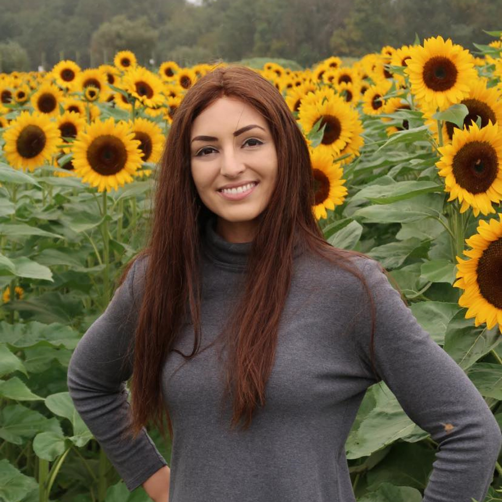
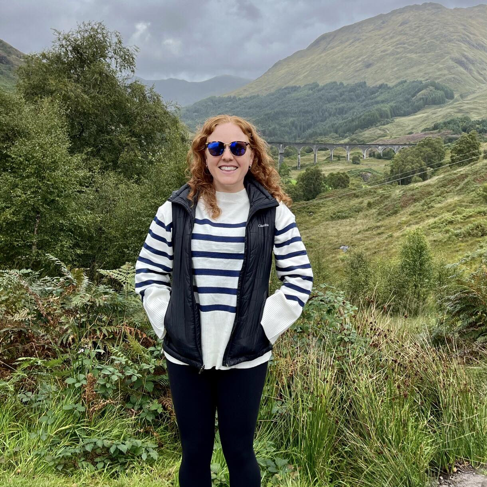
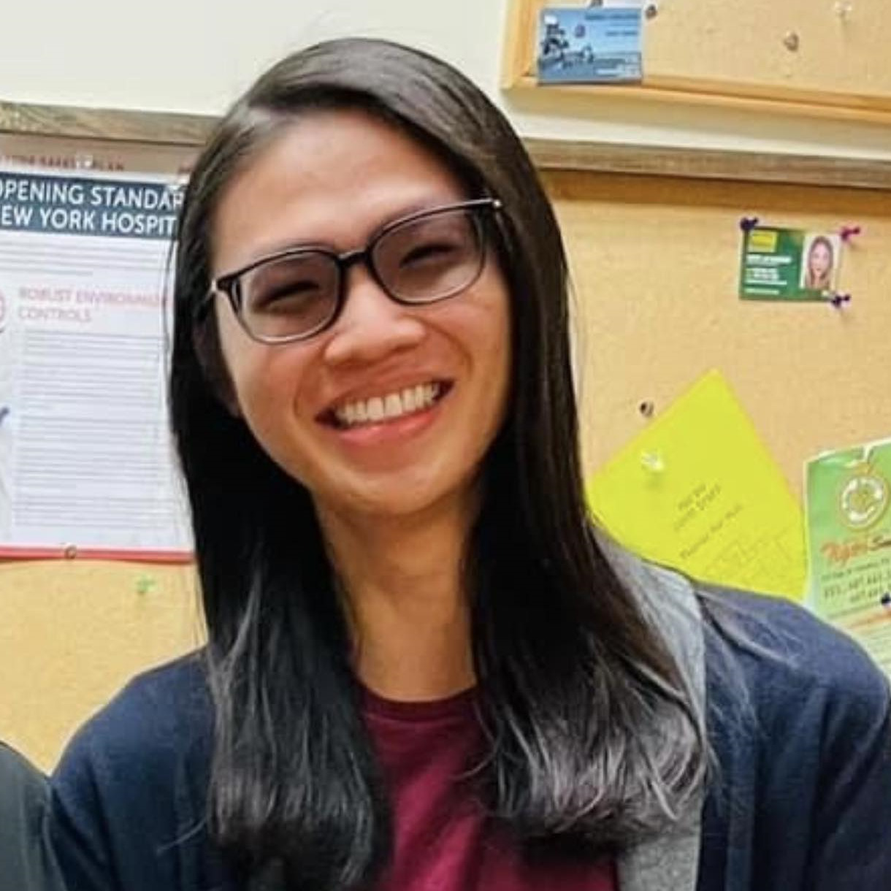
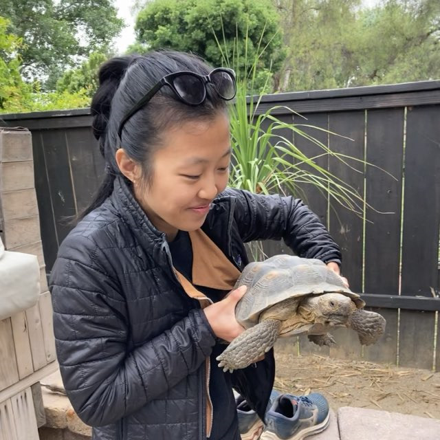
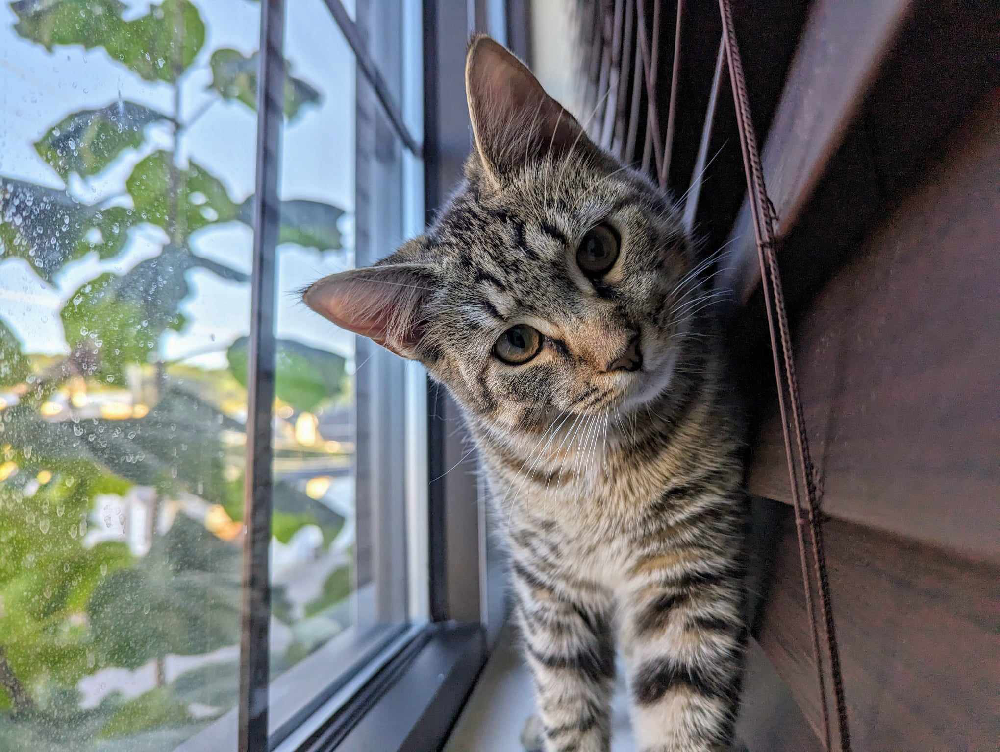
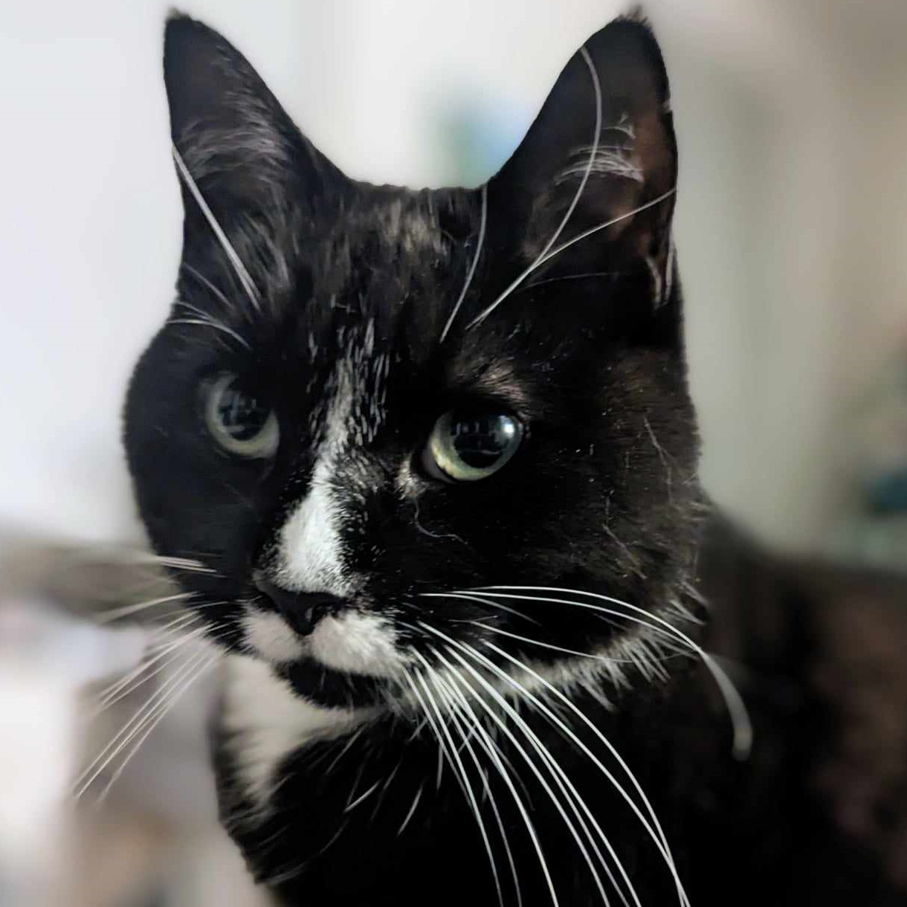

::: {.floatting}

```{r out.width='50%', out.extra='style="float:right; padding:10px"', echo=FALSE}

```
# Stephanie
### BFF of Honor

:::


<br>
<br>

::: {.floatting}

```{r out.width='50%', out.extra='style="float:right; padding:10px"', echo=FALSE}

```

# Ali
### Bridesmate

:::


<br>
<br>

::: {.floatting}

```{r out.width='50%', out.extra='style="float:right; padding:10px"', echo=FALSE}
knitr::include_graphics("images/malisha.jpg")
```

# Malisha
### Bridesmate

:::


<br>
<br>

::: {.floatting}

```{r out.width='50%', out.extra='style="float:right; padding:10px"', echo=FALSE}
knitr::include_graphics("images/manasa.jpg")
```

# Manasa
### Bridesmate

:::


<br>
<br>

::: {.floatting}

```{r out.width='50%', out.extra='style="float:right; padding:10px"', echo=FALSE}
knitr::include_graphics("images/pooja.jpg")
```

# Pooja
### Bridesmate

:::


<br>
<br>

::: {.floatting}

```{r out.width='50%', out.extra='style="float:left; padding:10px"', echo=FALSE}

```

# Victor
### Best Brother

:::


<br>
<br>

::: {.floatting}

```{r out.width='50%', out.extra='style="float:left; padding:10px"', echo=FALSE}
knitr::include_graphics("images/i.jpg")
```

# I
### Groomsmate

:::


<br>
<br>

::: {.floatting}

```{r out.width='50%', out.extra='style="float:left; padding:10px"', echo=FALSE}
knitr::include_graphics("images/jing.jpg")
```

# Jing
### Groomsmate

:::


<br>
<br>

::: {.floatting}

```{r out.width='50%', out.extra='style="float:left; padding:10px"', echo=FALSE}

```

# Monique
### Groomsmate

:::


<br>
<br>

::: {.floatting}

```{r out.width='50%', out.extra='style="float:left; padding:10px"', echo=FALSE}
knitr::include_graphics("images/waris.jpg")
```

# Waris
### Groomsmate

:::


<br>
<br>

::: {.floatting}

```{r out.width='50%', out.extra='style="float:left; padding:10px"', echo=FALSE}

```

# Yvonne
### Groomsmate

:::


<br>
<br>

::: {.floatting}

```{r out.width='50%', out.extra='style="float:right; padding:10px"', echo=FALSE}

```
# Evie
### Floof Ambassador
Evie likes to nap.
:::


<br>
<br>

::: {.floatting}

```{r out.width='50%', out.extra='style="float:right; padding:10px"', echo=FALSE}

```
# Pippin
### Floof Ambassador
Pippin's been cleaning her tux for the occasion. 
:::